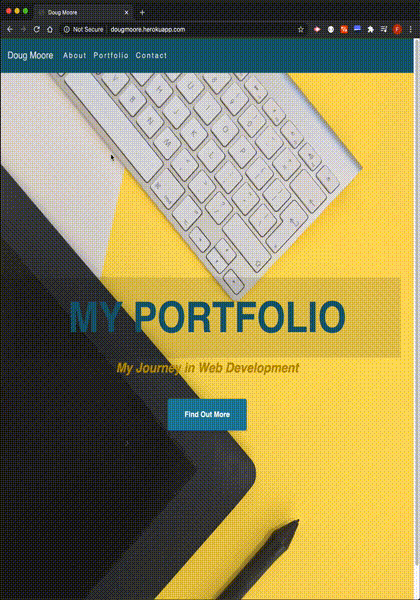

   

# react-portfolio
  react-portfolio is my updated portfolio built using React.

## Table of Contents
  - [Installation](#Installation)
  - [Usage](#Usage)
  - [License](#License)
  - [Contributing](#Contributing)
  - [Tests](#Tests)
  - [Questions](#Questions)

## Installation
  For just using the application, there is no installation required. The application url is http://dougmoore.herokuapp.com/.
  For the local setup of this application, there are a few npm modules that are required (react, react-scripts, react-dom, etc.). Once the repository is cloned, typing 'npm install' at the command prompt will install all of the required modules.
  Once the user clones and runs the program, the application will open in a browser window.
  Here is an example of the command to run in development mode:
  git clone https://github.com/AllAroundD/react-portfolio.git && cd react-portfolio && npm install && npm run startdev. A browser tab or window opens to 'http://localhost:3000/'
  To run local production mode, type 'npm start', then open a browser tab and go to 'http://localhost:5000'.

## Usage
  For just using the application, the application url http://dougmoore.herokuapp.com/ is where the application resides.
  If installing locally, see the installation steps above to install and then run the application to open a browser window/tab.

  react-portfolio is my updated portfolio built using React.

  Here is an example of my portfolio in action:
  

## License
  [MIT](LICENSE)

## Contributing
  

## Tests
  No formal tests documented. The usage demo gif above shows some of the tests that were performed.

## Questions

[GitHub Profile](https://github.com/AllAroundD/)

-If you have any questions, please contact me at [dougmoore@use.startmail.com](mailto:dougmoore@use.startmail.com?subject=[GitHub]%20Source%20Question).
